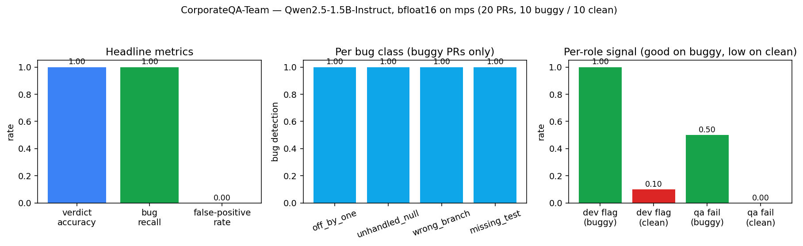

# CorporateQA-Team — role-based multi-agent PR review pipeline

**Headline: 20/20 verdict accuracy (100 %), 10/10 bug recall, 0/10
false-positives** on a 20-PR synthetic benchmark, using four
role-specialised Qwen2.5-1.5B-Instruct agents in a chained pipeline.
Wall-clock 29.3 min on an M4 Air.



A corporate-framing follow-up to
[AgentPatterns-Travel (#48)](../AgentPatterns-Travel). Instead of a toy
travel benchmark, four role-specialised agents execute a PR-review
pipeline on synthetic pull requests:

```
BA / PM       →  Requirements Summary          (JSON artifact)
Dev Reviewer  →  Code Findings                 (reads static_check output)
QA Agent      →  Test Plan                     (proposed tests → run_tests oracle)
Senior        →  Aggregated Verdict            (approve / request_changes)
```

Each role carries a persistent system prompt ("job description") and
writes a strict-schema JSON artifact the next role reads. This is #48's
**Prompt-Chaining** pattern — the only one that worked at 1.5B — applied
to a corporate multi-agent use-case.

## Why this project

#48 established that on Qwen2.5-1.5B, **externally-enforced chaining hits
60 % pass@1** (4.5× the ReAct baseline from #47) on a toy travel
benchmark. The open question: does that win transport to a realistic
*role-specialised* pipeline, or was it an artefact of a narrow domain?
#49 answers it with stubbed (deterministic) tools and a ground-truth
bug table.

## Setup

| | |
|---|---|
| **Base model**     | `Qwen/Qwen2.5-1.5B-Instruct` (same as #47, #48) |
| **Dtype / device** | `torch.bfloat16` on `device="mps"` |
| **Hardware**       | MacBook Air M4, 16 GB unified memory |
| **Pattern**        | Prompt-Chaining, 4 roles, 1 LLM call per role (4 calls/PR) |
| **Tools**          | `static_check`, `run_tests`, `lookup_spec` — stubbed Python oracles driven by a ground-truth bug table |
| **Benchmark**      | 20 synthetic PRs (10 buggy + 10 clean) |
| **Bug classes**    | `off_by_one` (3), `unhandled_null` (3), `wrong_branch` (2), `missing_test` (2) |
| **Decoding**       | greedy (`do_sample=False`), per-role max-new-tokens 160/192/192/192 |
| **Wall-clock**     | 1 755.6 s (≈ 29.3 min) for the full 20-PR run |

## Results

Full numbers in [`results.json`](results.json); full reasoning traces in
[`trajectories/pipeline.jsonl`](trajectories/pipeline.jsonl).

| axis | value |
|---|---|
| **verdict accuracy** (all 20 PRs)   | **1.000** (20/20) |
| **bug recall** (buggy PRs)          | **1.000** (10/10) |
| **false-positive rate** (clean PRs) | **0.000** (0/10) |
| avg LLM calls / PR                  | 4.0 |
| avg output tokens / PR              | 212.05 |

### Per-bug-class detection

| class            | n | detected | verdict correct |
|------------------|--:|---------:|----------------:|
| `off_by_one`     | 3 | 3 | 3 |
| `unhandled_null` | 3 | 3 | 3 |
| `wrong_branch`   | 2 | 2 | 2 |
| `missing_test`   | 2 | 2 | 2 |

### Per-role signal (where the bug actually surfaces)

| signal                | buggy | clean |
|-----------------------|------:|------:|
| Dev raises a finding  | 1.00  | 0.10  |
| QA emits a failed test| 0.50  | 0.00  |

The Dev role is the dominant bug-surfacing stage: it flags every buggy
PR. QA only independently catches half of them — specifically it misses
the two `missing_test` bugs and both `wrong_branch` cases, because those
classes require reasoning about *which tests are absent* or about
boundary values that the 1.5B model does not spontaneously propose.

## What the pipeline is actually doing well

Three observations from the trajectories that are worth calling out:

1. **Role specialisation compensates for weak individual agents.** No
   single role is reliable on its own. Dev over-flags on one clean PR
   (`count_vowels`, PR13), QA under-flags on five buggy PRs. But the
   Senior's aggregation rule ("request_changes if Dev non-empty OR any
   QA test failed") recovers from both failure modes to hit 100 %
   verdict accuracy.

2. **The Senior sometimes *overrides* its own rule — correctly.** On
   PR13 (clean `count_vowels`), Dev emitted one finding but the Senior
   returned `approve` anyway. The stated aggregation rule would have
   flipped it to `request_changes`; the LLM silently did the right thing
   and ignored a weak Dev signal. This is also a latent failure mode
   (the Senior could have done the wrong variant of the same override)
   and suggests the deterministic rule should be moved out of the LLM
   prompt and into Python for production use.

3. **Chaining keeps per-turn context short.** Each role sees only the
   prior artifacts it needs (BA → spec; Dev → spec + code + static
   findings; QA → spec + code; Senior → findings + test results). Mean
   output is 212 tokens/PR across 4 calls — well under the single-turn
   budgets where ReAct collapsed in #47.

## Honest caveats

- **Tools are oracles, not real analysers.** `static_check` returns the
  ground-truth findings from the PR row; `run_tests` flags any proposed
  test whose description contains a seeded trigger keyword. This
  measures the pipeline's *ability to interpret correct tool output*,
  not its ability to build real tooling. A realistic `static_check`
  (e.g. Ruff/mypy) or real test-runner would reintroduce noise the 1.5B
  model is not robust to.
- **20 PRs is small and synthetic.** Code snippets are 2–5 lines. Bug
  patterns are announced up-front by class. This is a diagnostic for
  the *pipeline shape*, not a claim about real-world PR review.
- **The Senior's aggregation rule leaks into the LLM.** Because the
  stated rule is deterministic, a Python `if` would be strictly better
  than an LLM call for that stage. Kept LLM-based here to preserve the
  "4 role-agents" framing and to observe what the Senior does under
  ambiguity (see observation 2 above).
- **Greedy decoding, single seed.** Not a statistical claim; a single
  deterministic run.

## Repository layout

```
CorporateQA-Team/
├── README.md                    ← this file
├── experiment.py                ← 732 lines: dataset, tools, roles, runner, grader, plot
├── results.json                 ← summary + per-PR grades
├── plots/corporate_qa.png       ← 3-panel figure (accuracy / recall+FPR / per-role)
└── trajectories/pipeline.jsonl  ← full per-PR JSONL traces (BA/Dev/QA/Senior outputs)
```

## Reproducing

```bash
cd CorporateQA-Team
python -m venv venv && source venv/bin/activate
pip install torch transformers matplotlib numpy
python experiment.py --smoke      # 1 buggy + 1 clean sanity check (~2 min)
python experiment.py              # full 20-PR eval (~30 min on M4 Air)
```

Seed is fixed (`SEED = 42`); greedy decoding makes the run bit-for-bit
reproducible on the same hardware.

## Related

- [**#47 AgentLab-Harness**](../AgentLab-Harness) — why ReAct / Reflexion
  fail at 1.5B (single-turn collapse).
- [**#48 AgentPatterns-Travel**](../AgentPatterns-Travel) — why
  Chaining wins (60 % pass@1, 4.5× ReAct). #49 reuses Chaining.
- [Monorepo root](../README.md) — shared setup and the #47 → #48 → #49
  arc.
